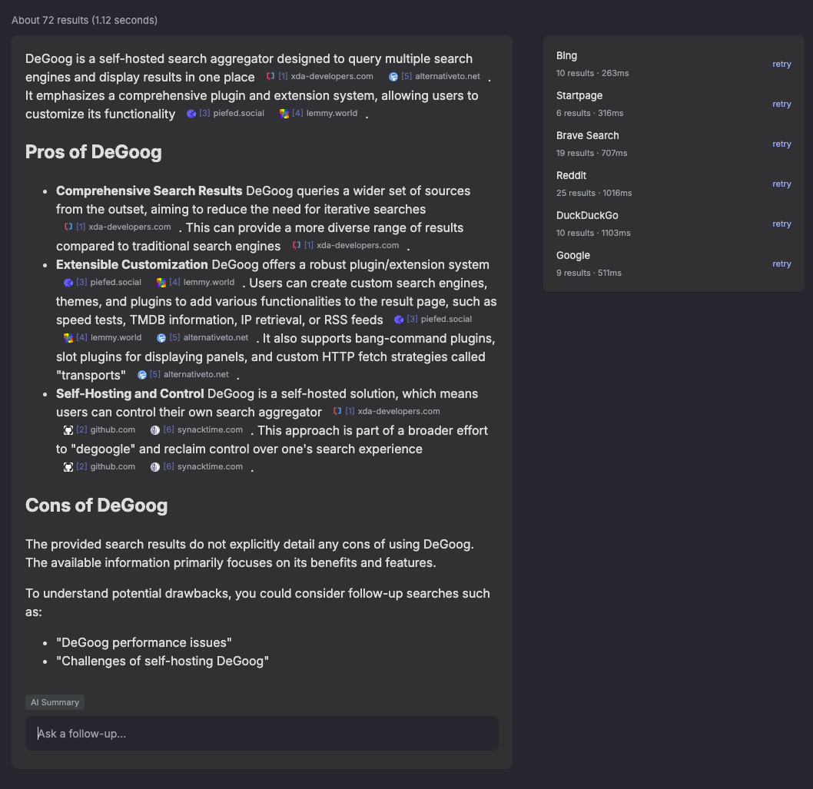

# AI Summary

Streams an AI-written answer above the search results, with inline `[N]` citations back to the sources it used, plus a follow-up chat under it. Everything is fetched server side, so your API key never reaches the browser.

<div align="center">
    
</div>

## Providers

| Provider | Endpoint used | Notes |
| --- | --- | --- |
| OpenAI compatible | `POST {baseUrl}/chat/completions` | The catch-all. Sends no provider-specific thinking flags |
| OpenAI | same, default `https://api.openai.com/v1` | Adds `reasoning_effort` when thinking is on |
| OpenRouter | same, default `https://openrouter.ai/api/v1` | Adds the `reasoning` block |
| Ollama | `POST {origin}/api/chat` | Token cap goes to `options.num_predict` |
| llama.cpp / vLLM | `POST {baseUrl}/chat/completions` | Adds `chat_template_kwargs.enable_thinking` |
| LM Studio | same, default `http://localhost:1234/v1` | |
| Google Gemini | `:streamGenerateContent` | Token cap goes to `generationConfig.maxOutputTokens` |
| Anthropic Claude | `POST {baseUrl}/messages` | Thinking uses a token budget |

**Detect** asks your endpoint what it is and sets the provider for you. **Fetch models** lists what that endpoint serves, but any model id can be typed by hand.

## Settings

| Setting | Notes |
| --- | --- |
| API Base URL | Blank uses the provider default. Bare origins get the standard path appended |
| API Key | Not needed for local servers |
| Provider | Set it with **Detect**, or pick one |
| Model | Set it with **Fetch models**, or type an id |
| Token limit parameter | `max_tokens` or `max_completion_tokens`, see below |
| Extra request headers | Custom headers per request, see below |
| Let reasoning models think | Off by default. Thoughts stream live and clear when the answer starts |
| Only trigger on questions | Summarize only when the query ends with `?` |
| Hide summary on error | Remove the box instead of showing the error |
| Timeout / Max Tokens | Defaults `180` seconds and `2048` tokens. Reasoning models need budget for thinking *and* answer |
| Custom System Prompt | Blank uses the built-in one |

## Token limit parameter

OpenAI-style APIs disagree about which field carries the token cap. Older models take `max_tokens`; newer OpenAI reasoning models reject it outright:

```
Unsupported parameter: 'max_tokens' is not supported with this model.
Use 'max_completion_tokens' instead.
```

If you see that, switch **Token limit parameter** to `max_completion_tokens`. The default stays `max_tokens`, which is what everything else expects. Gemini, Anthropic and Ollama ignore this setting, they have their own field.

## Extra request headers

Some gateways want headers of their own. One `Name: value` per line, sent with every request, including the **Fetch models** lookup:

```
x-opencode-session: {{session}}
X-Title: degoog
```

`{{session}}` is replaced with a stable id for the current conversation, `degoog-` plus a short hash. The same summary keeps the same id across retries, and a follow-up thread keeps the id it started with, so a gateway that routes by session sees one conversation instead of many. OpenCode Go needs exactly this in `x-opencode-session` and returns `400 MissingSessionID` without it.

Rules worth knowing:

- Lines starting with `#` are comments, blank lines are ignored.
- `Content-Type` and `Accept` cannot be overridden, they keep streaming working.
- `Authorization` can be overridden if your gateway wants a different scheme than `Bearer`.
- Up to 20 headers. Malformed lines are skipped with a warning in the server log.

## Limitations

- The summary only runs once results are in, so it adds the model's latency on top of the search.
- Summaries are cached for two minutes per query and result set; follow-ups are never cached.
- If a model streams nothing but thoughts for 45 seconds with thinking turned off, the request is abandoned.
