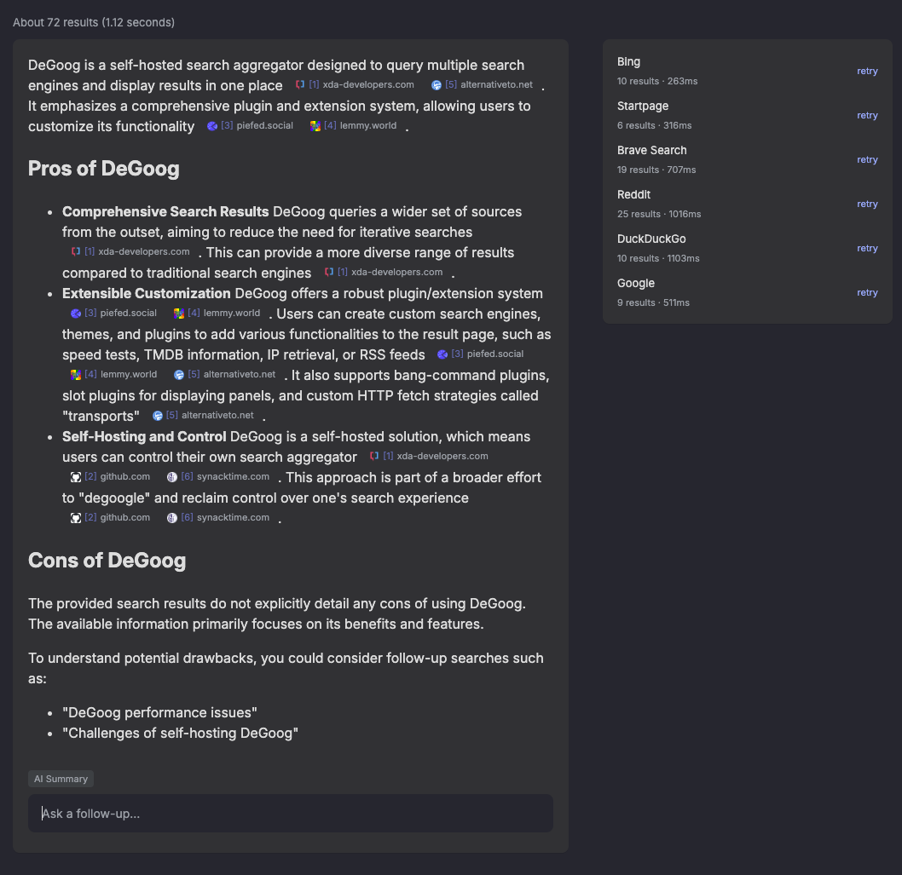

# AI Summary

Streams an AI-written answer above the search results, with inline `[N]` citations back to the sources it used, plus a follow-up chat under it. Everything is fetched server side, so your API key never reaches the browser.

<div align="center">
    
</div>

## Providers

| Provider | Endpoint used | Notes |
| --- | --- | --- |
| OpenAI compatible | `POST {baseUrl}/chat/completions` | The catch-all. Sends no provider-specific thinking flags |
| OpenAI | same, default `https://api.openai.com/v1` | Adds `reasoning_effort` when thinking is on |
| OpenRouter | same, default `https://openrouter.ai/api/v1` | Adds the `reasoning` block |
| Ollama | `POST {origin}/api/chat` | Token cap goes to `options.num_predict` |
| llama.cpp / vLLM | `POST {baseUrl}/chat/completions` | Adds `chat_template_kwargs.enable_thinking` |
| LM Studio | same, default `http://localhost:1234/v1` | |
| Google Gemini | `:streamGenerateContent` | Token cap goes to `generationConfig.maxOutputTokens`. See below for thinking |
| Anthropic Claude | `POST {baseUrl}/messages` | Thinking uses a token budget |
| Perplexity | `POST {baseUrl}`, default `https://api.perplexity.ai/v1/agent` | Agent API. Model is `provider/model` or a preset, see below |

Pick the provider first, and the settings below it change to match. Each provider shows a short note on what it needs. Fields like **Token limit parameter** and **Reasoning effort** only appear for providers that use them. **Detect** asks your endpoint what it is and sets the provider for you. **Fetch models** lists what that endpoint serves, but any model id can be typed by hand.

## Settings

| Setting | Notes |
| --- | --- |
| Provider | Set it with **Detect**, or pick one. The rest of the form follows it |
| API base URL | Blank uses the provider default. Bare origins get the standard path appended |
| API key | Local servers don't need one |
| Model | Set it with **Fetch models**, or type an id |
| Token limit parameter | OpenAI-style providers only. `max_tokens` or `max_completion_tokens`, see below |
| Extra request headers | Advanced. Custom headers per request, see below |
| Let reasoning models think | Off by default. Thoughts stream live and clear when the answer starts |
| Reasoning effort | OpenAI, OpenRouter, Gemini and Perplexity, with thinking on. Low, medium or high |
| Only trigger on questions | Summarize only when the query ends with `?` |
| Hide summary on error | Remove the box instead of showing the error |
| Open links in a new tab | Off by default. Citations, sources and links in the answer open in a new tab |
| Answer in the visitor's language | Perplexity only, on by default. Sends the browser's language as `language_preference` |
| Timeout / Max tokens | Defaults `180` seconds and `2048` tokens. Reasoning models need budget for thinking *and* answer |
| Custom system prompt | Advanced. Blank uses the built-in one |

## Token limit parameter

OpenAI-style APIs disagree about which field carries the token cap. Older models take `max_tokens`. Newer OpenAI reasoning models reject it with this error:

```
Unsupported parameter: 'max_tokens' is not supported with this model.
Use 'max_completion_tokens' instead.
```

If you see that, switch **Token limit parameter** to `max_completion_tokens`. The default stays `max_tokens`, which is what everything else expects. Gemini, Anthropic, Perplexity and Ollama ignore this setting because they have their own field.

## Perplexity

Perplexity moved off Chat Completions to its Agent API, so it has its own provider instead of going through OpenAI compatible. A blank base URL uses `https://api.perplexity.ai/v1/agent`, and a bare origin gets `/v1/agent` added. The older `/v1/responses` is still accepted as an alias. A full path is kept as typed, so if Perplexity moves the route again you only change the field. **Fetch models** reads `models` next to it, here `https://api.perplexity.ai/v1/models`.

The model field takes either:

- A model id in `provider/model` form, like `openai/gpt-5.6-sol` or `anthropic/claude-sonnet-4-6`. **Fetch models** lists them. The model answers from your search results only, so the `[N]` citations line up.
- A preset: `fast`, `low`, `medium`, `high` or `xhigh`. Presets run Perplexity's own web search on top of your results. They answer well, but the citations they add don't point at degoog's sources, and the higher ones are slow and cost more. `fast`, `low`, `medium` and `high` run Perplexity's cheaper Fast Search; `xhigh` runs the full web search. A `provider/model` id runs no search, so you only pay for tokens.

**Let reasoning models think** sends `reasoning.effort` set to **Reasoning effort**.

**Answer in the visitor's language** sends the primary subtag of the browser's language, like `it` for `it-IT`, as `language_preference`. Codes that aren't two letters are dropped.

## Gemini

Gemini 3 models take a thinking level instead of a token budget, and none of them can switch thinking off. With thinking off, degoog asks for the lowest level the model takes, `minimal` or `low`. Gemini 2.x models still get `thinkingBudget: 0`. If a model answers `400 Request contains an invalid argument`, degoog retries with the next request shape the API accepts and remembers the one that worked for that model until the server restarts. Gemma models served through the Gemini API get the system prompt folded into the first message, since they don't take one of their own.

## Adding a provider

Each provider lives in one file under `providers/`. Its adapter exports `stream` plus a `settings` block with the label, what it requires, a short note for the settings dialog, and any extra fields it uses. Shared fields like **Token limit parameter** and **Reasoning effort** are in `providers/fields.js`. The settings dialog is built from those blocks, so a field shows for exactly the providers that list it.

## Extra request headers

Some gateways want headers of their own. One `Name: value` per line, sent with every request, including the **Fetch models** lookup:

```
x-opencode-session: {{session}}
X-Title: degoog
```

`{{session}}` is replaced with a stable id for the current conversation, `degoog-` plus a short hash. The same summary keeps the same id across retries, and a follow-up thread keeps the id it started with, so a gateway that routes by session sees one conversation instead of many. OpenCode Go needs exactly this in `x-opencode-session` and returns `400 MissingSessionID` without it.

Rules worth knowing:

- Lines starting with `#` are comments. Blank lines are ignored.
- You can't override `Content-Type` or `Accept`. Streaming depends on them.
- You can override `Authorization` if your gateway wants a scheme other than `Bearer`.
- Up to 20 headers. degoog skips malformed lines and logs a warning on the server.

## Limitations

- The summary only runs once results are in, so it adds the model's latency on top of the search.
- degoog caches summaries for two minutes per query and result set. It never caches follow-ups.
- If a model streams nothing but thoughts for 45 seconds with thinking turned off, the request is abandoned.
