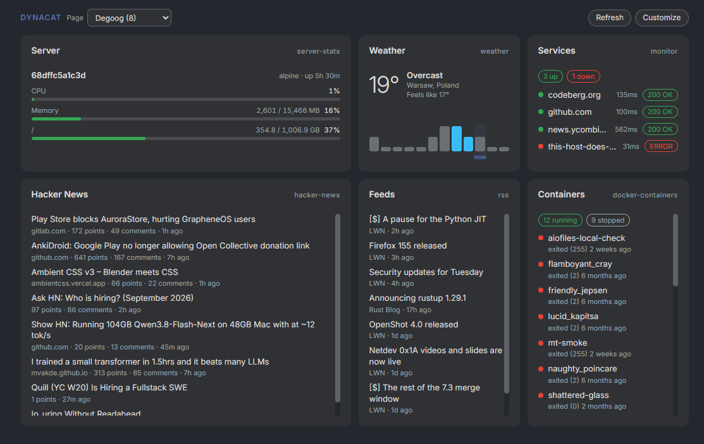

# Dynacat

Pulls widget data from a [Dynacat](https://github.com/Panonim/dynacat) dashboard through its read-only API and shows the widgets you pick on the degoog home page. `!dynacat` renders the same cards in the results area, and `!dynacat <text>` filters them by title or widget type.

<div align="center">
    
</div>

## Dynacat side

Enable the API in your Dynacat config:

```yaml
api:
  enabled: true
  token: your-token
```

No CORS setup is needed: degoog fetches server side, so the token never reaches the browser.

## Settings

| Setting | Notes |
| --- | --- |
| Dynacat URL | Base URL, for example `http://dynacat:8080` |
| API token | Value of `api.token` |
| Page | Loaded live from `/api/v1/pages` once the URL and token are set |
| Show on home page | Render the dashboard under the search bar |
| Show on mobile | Hide it on narrow screens if you prefer |
| Refresh interval | How long data is cached before Dynacat is asked again |
| Username / Password | Only for pages restricted with `allowed-users` |

## Picking what matters

The **Customize** button on the dashboard opens a picker where every widget on the selected page can be shown or hidden, made single or double width, and reordered. The choice is stored per page in `data/dynacat-dashboard.json`, so widgets added in Dynacat later appear at the end instead of replacing your layout.

Widgets that Dynacat does not expose data for (search, bookmarks, clock, to-do, calendar and similar) are left out of the picker. Types without a dedicated renderer fall back to stat tiles and short tables.

## Limitations

- Dynacat strips configured values from API responses, so titles and links defined in its YAML are not always available.
- `custom-api` and `dynawidgets` only expose the raw upstream JSON, which is shown as formatted JSON.
