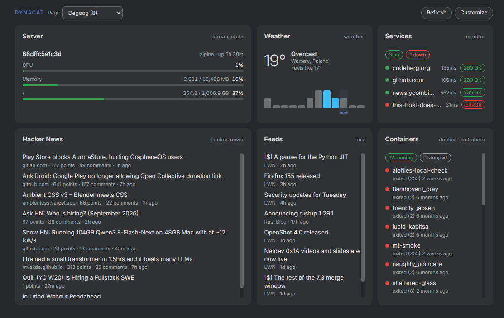

# Dynacat

Pulls widget data from a [Dynacat](https://github.com/Panonim/dynacat) dashboard through its read-only API and shows the widgets you pick on the degoog home page. `!dynacat` renders the same cards in the results area, and `!dynacat <text>` filters them by title or widget type.

<div align="center">
    
</div>

## Dynacat side

Enable the API in your Dynacat config:

```yaml
api:
  enabled: true
  token: your-token
```

You don't need any CORS setup. degoog fetches server side, so the token never reaches the browser.

## Settings

| Setting | Notes |
| --- | --- |
| Dynacat URL | Base URL, for example `http://dynacat:8080` |
| API token | Value of `api.token` |
| Default page | degoog loads the list from `/api/v1/pages` once the URL and token are set |
| Show on home page | Render the dashboard under the search bar |
| Show on mobile | Hide it on narrow screens if you prefer |
| Refresh interval | Seconds degoog caches widget data before asking Dynacat again |
| Username / Password | Only for pages restricted with `allowed-users` |

## Picking what matters

The **Customize** button on the dashboard opens a picker. There you can show or hide each widget on the selected page, make it single or double width, and change the order. degoog saves your layout per page in `data/dynacat-dashboard.json`, so widgets you add in Dynacat later show up at the end and leave your layout alone.

The picker leaves out widgets Dynacat exposes no data for, such as search, bookmarks, clock, to-do and calendar. Widget types without their own renderer fall back to stat tiles and short tables.

## Limitations

- Dynacat strips configured values from API responses, so titles and links set in its YAML don't always come through.
- `custom-api` and `dynawidgets` only expose the raw upstream JSON, so degoog shows that JSON formatted.
